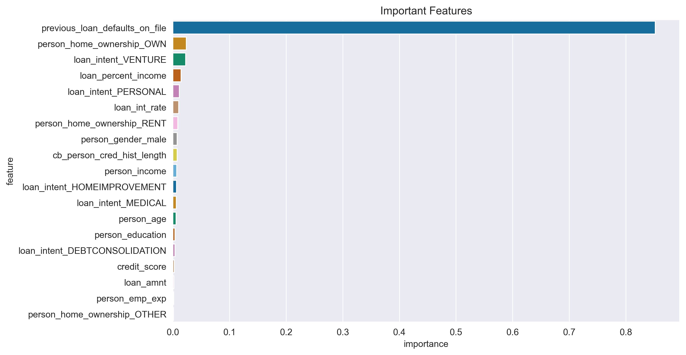

# 💳 Credit Risk Classification Analysis

## 🔍 Business Understanding

A classification project to assess and predict the **credit risk of loan applicants** using **Logistic Regression** and **Decision Trees**. This analysis aims to identify high-risk borrowers and assist lending institutions in making more data-informed, risk-sensitive credit decisions.

---

## 📌 Project Goals

The primary objective is to develop a **predictive model** to:
- Identify **key drivers of loan default**
- Predict **likelihood of default** with ≥80% accuracy
- Prioritize **recall** to minimize missed defaulters (false negatives)
- Provide **interpretable outputs** for regulatory and policy alignment

---

## 📂 Project Structure

- `data`: Raw or sample dataset
- `notebook.pdf`: Summary of Jupyter Notebooks for EDA  and modeling
- `presentation.pdf`: Slide deck or final presentation
- `images`: Visualizations (ROC, confusion matrix, etc.)
- `requirements.txt`: List of required Python libraries
- `index.ipynb`: Main analysis notebook
- `README.md`: Project documentation 

## 🧪 Methods Used

- **Exploratory Data Analysis (EDA)**
  - Distribution analysis of default rates by demographic and loan attributes
  - Boxplots, countplots, correlation heatmap

- **Data Preprocessing**
  - One-hot encoding (with `category_encoders`)
  - Scaling (MinMaxScaler)
  - Class imbalance handled using **SMOTE**

- **Modeling**
  - Logistic Regression (with and without SMOTE)
  - Decision Tree Classifier
  - Hyperparameter tuning via `GridSearchCV`

- **Evaluation Metrics**
  - Precision, Recall, F1-score, Accuracy
  - **AUC-ROC Curve**
  - Confusion Matrix

---

## 📊 Key Visualizations

| Visualization                       | Sample |
|------------------------------------|--------|
| 📈 ROC Curve (Model Comparison)     |  |
| 📊 Confusion Matrix (DT + SMOTE)    |  |
| 📌 Feature Importance (Decision Tree) |  |

---

## ✅ Final Recommendation

### 💡 Recommended Model: **Decision Tree with Hyperparameter Tuning**

| Metric     | Score |
|------------|-------|
| Accuracy   | 90.85% |
| Recall     | 75.44% |
| F1-Score   | 78.51% |
| AUC        | 90.77% |

> Chosen due to its high accuracy and **balanced recall**, while maintaining **interpretability** for credit decision-making.

---

## 💻 How to Run This Project

1. **Clone the repo**
2. **Create a virtual environment (optional)**
3. **Install dependencies**
4. **Launch the notebook**

## 📦 **Requirements**
- pandas
- numpy
- matplotlib
- seaborn
- scikit-learn
- imbalanced-learn
- category_encoders

## 📌 Future Work
- Add XGBoost and Random Forest for deeper comparison
- Deploy best model

## 👤 **Author**
📧 **Patrice Okoiti**-okoitipatrice96@gmail.com

🔗 **GitHub – @Patoh254code**

